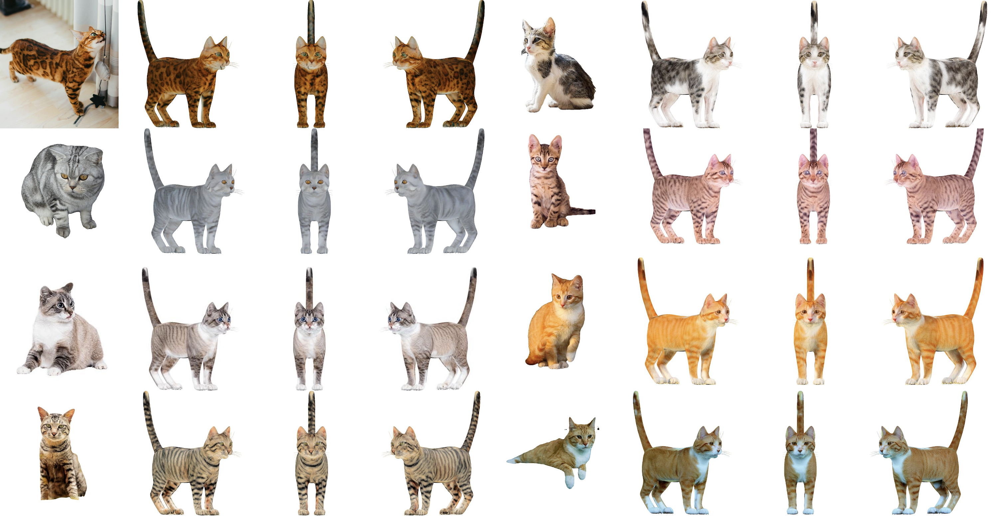

<div align="center">

# TexGenerator: Advancing High-Quality Texture Creation with Image-Guided Diffusion Models
## [arXiv Preprint]() | [Project](https://TexGenerator.github.io) 

</div>

<div  align="center">
    <a>
    
    </a>
  </div>
</p>
In this paper, we introduce TextureGenerator, an innovative framework designed to  produce high-quality textures for 3D Meshes form the given reference images. Our approach introduces  a novel framework for few-shot style personalization of diffusion models by employing a combination of Stable diffusion XL, Low Ranked Adapters (LoRA),ControlNets and IP-Adapter,These components are cascaded during training to produce a personalized diffusion model tailored to the reference images, for cases where the Pre-trained ControlNet and LORA parameters affect each other, and the pre-trained IP-Adapter also fails to capture image details from the input reference image . Additionally,We integrate a multi-view diffusion model to generate precise 3D textures that ensure both style and semantic consistency. Furthermore, we also propose an automatic multi-view texture compositing technique, which ensures the compositing of high-quality texture.Compared to the current state-of-the-art methods, TextureGenerator significantly enhances the similarity and quality of textures generated from reference images, providing strong support for the creation of realistic, high-quality 3D assets.

## More Results
<div  align="center">
    <a>
    
    </a>
  </div>
  
## 🚩 News
-  Paper and code coming soon, stay tuned! 🔥

## 📖 Citation
```bibtex
@article{TexGenerator,
  title={TexGenerator: Advancing High-Quality Texture Creation with Image-Guided Diffusion Models},
  author={},
  journal={arXiv preprint arXiv:},
  year={2024}
}
```
